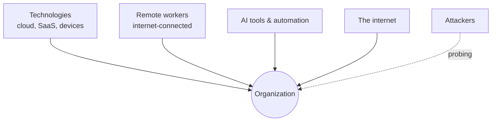
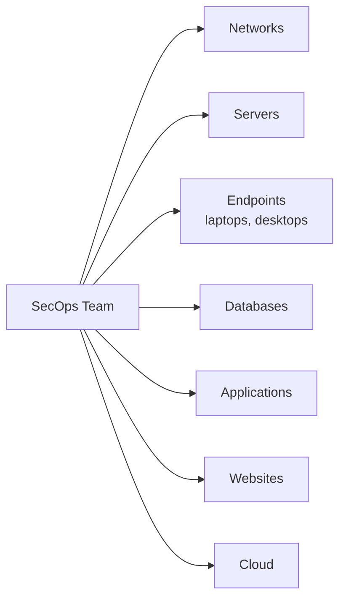
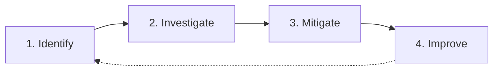
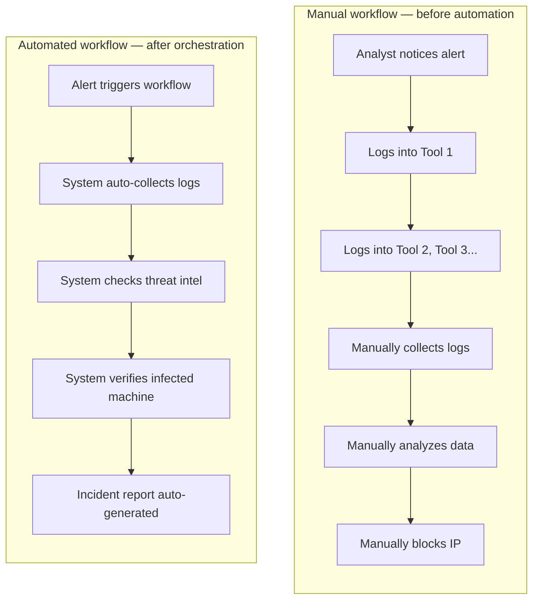
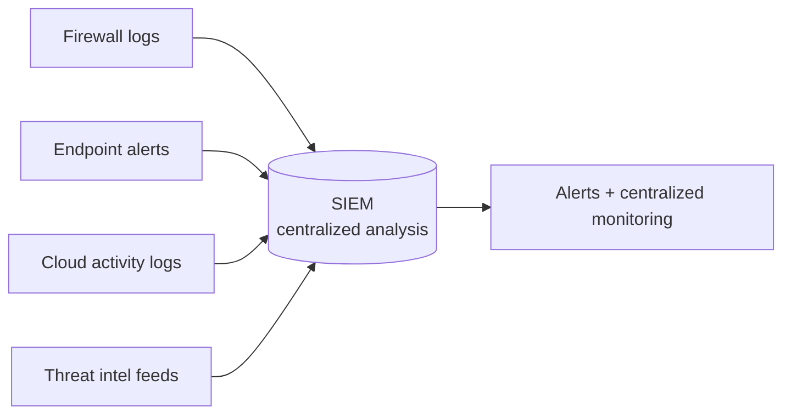
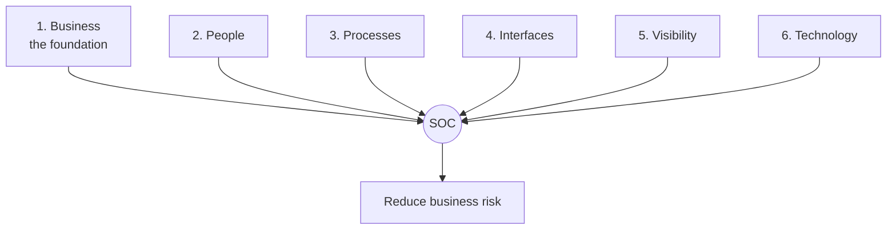

# Module 01 — SOC Fundamentals

**Source material:** Palo Alto Beacon, supplemented with independent research and hands-on lab work
**Handwritten notes:** [`/notes/module-01-handwritten.pdf`](../notes/module-01-handwritten.pdf) or https://drive.google.com/drive/folders/1-7-RDTk38OgjX7hIJzDfpPkrzrIyDijr?usp=sharing

**Lab environment used throughout:** Ubuntu Server running Wazuh as SIEM, Windows + Ubuntu VMs as Wazuh agents, Kali Linux as the attacker machine

---

## Contents

1. [The Security Landscape](#1-the-security-landscape)
2. [Security Operations — The Active Defense Team](#2-security-operations--the-active-defense-team)
3. [Security Orchestration](#3-security-orchestration)
4. [SIEM, Threat Intelligence, and the Detection Stack](#4-siem-threat-intelligence-and-the-detection-stack)
5. [The Six Pillars of a SOC](#5-the-six-pillars-of-a-soc)
6. [Metrics — Why Most of Them Lie to You](#6-metrics--why-most-of-them-lie-to-you)
7. [Reporting and Executive Communication](#7-reporting-and-executive-communication)
8. [Module Summary](#8-module-summary)
9. [References](#references)

---

## 1. The Security Landscape

Every organization that has anything worth stealing — data, money, reputation, customer trust — needs some function whose entire job is defending it. That function is Security Operations, or SecOps. It exists because the alternative, no dedicated defense function at all, has historically gone very badly for a lot of companies.

For a long time, organizations handled security reactively. Buy a firewall here, an antivirus there, maybe a vulnerability scanner if budget allows, and hope it's enough. This is what's referred to as a collection of point solutions — individual tools bought to solve individual problems, with little to no coordination between them. The shift happening across the industry right now is away from that scattered approach and toward a single, deliberate structure: a dedicated SecOps function managing one unified security architecture.

A useful way to picture the security landscape is as a battlefield map. It isn't just "the company's computers" — it's everything that touches the organization's digital footprint:

What makes today's version of this map different from, say, ten years ago is the shift in shape. Organizations used to operate mostly inside a defined perimeter — a building, a network, a set of company-owned machines. That perimeter has effectively dissolved. The modern landscape is:

- **More cloud-based** — workloads and data live across AWS, Azure, GCP, and dozens of SaaS platforms instead of a single data center
- **More remote** — employees connect from home networks, coffee shops, and personal devices, all outside traditional network boundaries
- **More connected** — APIs, third-party integrations, and IoT devices multiply the number of systems that can be an entry point
- **More AI-driven** — both defenders and attackers are now using AI/ML tooling, which changes the speed and scale of both detection and attack
- **More vulnerable** — every one of the above points adds attack surface; there are simply more doors to check

### What's actually at stake

**The biggest risk: a catastrophic breach.** This isn't abstract — a serious breach can cause several compounding forms of damage simultaneously:

| Consequence | What it actually looks like |
|---|---|
| Data theft (exfiltration) | Customer PII, intellectual property, or credentials leave the organization without authorization |
| Financial loss | Direct costs (incident response, legal, regulatory fines) plus indirect costs (downtime, lost business) |
| Reputation damage | Public trust erodes — sometimes permanently, especially in regulated industries |
| Loss of customers | Churn following a publicized breach, especially in B2B and financial services |
| Legal penalties | GDPR, HIPAA, PCI-DSS and similar frameworks carry real financial and legal consequences for non-compliance |

The note worth internalizing here: **one major breach can undo years of accumulated trust.** A company can do everything right for a decade and still be defined by a single bad incident — which is exactly why SecOps as a function exists, and why it's treated as a continuous, never-finished job rather than a project with an end date.

### Why organizations struggle

Most organizations don't fail at security because they don't care. They fail because of structural problems that compound over time:

- **Alert fatigue** — too many security alerts, most of them low-value, drowning out the ones that matter
- **Tool sprawl without integration** — a dozen security tools that don't talk to each other, each requiring separate manual review
- **Slow incident response** — by the time a human notices and acts, the attacker has had time to move
- **Skills shortage** — there's a well-documented global shortage of trained security analysts, and most teams are understaffed relative to their alert volume

Without structure, security becomes chaotic — alerts pile up, nobody owns the response, and the organization is reacting to whatever is loudest instead of whatever is most dangerous.

### What good SecOps is actually trying to achieve

The target objective for any SecOps function comes down to five things: detect threats early, respond quickly, reduce damage, protect sensitive data, and maintain business continuity. Every tool, every process, and every metric discussed later in this document exists in service of those five outcomes — nothing else really matters if these aren't being achieved.

To prove it's achieving them, a security team has to produce concrete deliverables: continuous monitoring, incident reports, threat analysis, risk assessments, and a demonstrably improving security posture over time. "Trust us, we're handling it" isn't good enough — there has to be evidence.

---

## 2. Security Operations — The Active Defense Team

If the security landscape is the battlefield, SecOps is the standing army. It's the team (or, in smaller organizations, sometimes a single overworked person) whose job is to actively defend the organization rather than just configure tools and hope.

Their scope of monitoring covers essentially everything that can be compromised:

Their actual job, day to day, breaks into four repeating responsibilities: identify threats, investigate suspicious activity, mitigate attacks, and continuously improve security. This isn't a one-time checklist — it's a loop that never stops, because new threats and new vulnerabilities show up constantly.

### The detection-to-resolution loop

This loop is worth understanding in detail because it's the actual operational rhythm of any SOC, junior analyst or otherwise.

**Step 1 — Identify.** This means recognizing a suspicious alert in the first place. A textbook example: an unusual login attempt at 3 AM, from an account that normally only logs in during business hours, from a country the user has never logged in from before. The action at this stage is simple — open an incident. Don't ignore it, don't assume it's nothing.

**Step 2 — Investigate.** This is where the actual analytical work happens. The analyst pulls logs, examines network traffic, and looks at user behavior, asking a specific set of questions:

- Is this real, or is it a false alarm?
- Where did it start?
- What systems are affected?

This step is the one most often rushed under pressure — and rushing it is exactly how real incidents get missed or misclassified, which is a theme that comes back later under metrics.

**Step 3 — Mitigate.** Once the investigation confirms something real is happening, the team acts to stop it. Common mitigation actions include blocking the malicious IP address, isolating the infected system from the rest of the network so it can't spread, and resetting any compromised passwords or credentials.

**Step 4 — Continuously improve.** After the immediate fire is out, the work isn't done. The team should update detection rules so the same attack triggers faster next time, work on improving response time, learn from what went wrong (or what went right), and generally strengthen the defense based on what was just learned. Skipping this step is how organizations end up fighting the same incident repeatedly.

### Lab notes

I built this exact loop end-to-end in my home lab rather than just reading about it. Using my Kali box as the attacker, I ran a brute-force login attempt against the Windows agent monitored by Wazuh. The Wazuh SIEM fired an alert almost immediately. From there I went through the investigation step manually — pulling the raw alert, checking the source IP and the targeted account — and then wrote a custom Wazuh decoder to reduce false positives on that rule going forward. That last part is the "continuously improve" step in practice: the first version of the rule was noisy, so the rule itself had to evolve.

📸 *[Add: screenshot of the Wazuh alert showing the brute-force detection]*
📸 *[Add: screenshot of the custom decoder/rule I wrote, with a short explanation of what it changed]*

---

## 3. Security Orchestration

Once a SOC has more than a couple of tools running, a new problem appears: those tools don't naturally talk to each other. A firewall doesn't know what the SIEM saw. The SIEM doesn't automatically tell the endpoint protection tool to quarantine a machine. Without something tying them together, every response action becomes a manual, multi-tool process — which is slow, error-prone, and doesn't scale as alert volume grows.

**Security orchestration** is the answer to that problem: connecting different security tools together through automated workflows, so instead of working in isolation, tools communicate with each other, share data, follow automated response steps, and reduce the amount of manual effort required from a human analyst. The end result is that security teams respond to incidents faster and more consistently.

### What changes with automation

The difference between a manual and an automated SOC workflow is stark enough that it's worth walking through both side by side.

The manual version isn't just slower, it's a genuine waste of skilled analyst time on work a script could do. The automated version compresses what might take 30-60 minutes of manual tool-hopping into something that finishes in minutes, freeing the analyst to spend their time on judgment calls rather than data collection.

The measurable benefits of doing this well: reduced human workload, reduced alert fatigue (because low-confidence alerts get auto-triaged instead of all landing in a human's queue), increased response speed, and improved accuracy (because the automation doesn't get tired or distracted the way a human reviewing alert #340 of the day might).

### The vocabulary that matters here

These four terms come up constantly in any SOC or detection engineering context, and they're often used loosely, so it's worth being precise:

| Term | Definition | Concrete example |
|---|---|---|
| **Security automation** | Using technology to perform security tasks without human intervention | Automatically blocking a known-malicious IP the moment it's flagged by threat intel |
| **Playbooks** | Predefined, step-by-step procedures for handling specific incident types | "If ransomware is detected → isolate the endpoint → alert the admin → trigger backup restore" |
| **Integration** | The mechanism by which different tools connect and exchange data — usually REST APIs, webhooks, or purpose-built connectors | A SIEM pushing alert data to a messaging platform via webhook |
| **Ingestion** | The process of pulling data from many different sources into one central platform | Firewall logs, endpoint alerts, cloud activity logs, and threat intel feeds all flowing into a single SIEM |

Playbooks specifically are worth dwelling on, because they solve three very concrete operational problems: they standardize the response so two different analysts handling the same incident type act the same way, they eliminate confusion about who does what during a high-stress incident, and they speed up handling because nobody has to improvise a process under pressure.

### Lab notes

I implemented a small but real piece of orchestration in my lab: integrating Wazuh with Telegram so that alerts get pushed directly to my phone the moment a rule fires, instead of requiring me to be actively watching the dashboard. It's a tiny example compared to enterprise SOAR platforms wiring together a dozen tools, but the underlying mechanism — integration via webhook, automated notification instead of manual checking — is the same principle at a smaller scale.

📸 *[Add: screenshot of a Wazuh alert arriving in Telegram]*

---

## 4. SIEM, Threat Intelligence, and the Detection Stack

This section covers the core technology components that make detection possible in the first place. These pieces are the backbone of orchestration systems — automation has nothing to orchestrate without them feeding it data.

### SIEM — Security Information and Event Manager

A SIEM collects and analyzes logs from across the entire organization in one place. Its core functions are detecting suspicious patterns across that aggregated data, generating alerts when something looks wrong, and centralizing monitoring so analysts aren't checking ten different dashboards.

The simplest mental model for what a SIEM does: **it's a brain that sees everything.** Individual tools see their own slice of activity — the firewall sees network traffic, the endpoint agent sees what's happening on one machine. The SIEM is the only component with visibility across all of it simultaneously, which is precisely what makes it possible to catch attacks that span multiple systems (something no single point tool could detect on its own).

### Threat Intelligence

A SIEM alert on its own doesn't tell you whether something is dangerous — it tells you something happened. Threat intelligence is the context layer that answers the actual question an analyst cares about: **"Is this alert really dangerous?"**

It does this by providing structured information about known-bad indicators:

- Malicious IP addresses
- Malware hashes
- Phishing domains
- Known attack techniques

Without threat intel, an analyst is investigating every alert from a position of "I have no idea if this IP is dangerous." With it, an alert involving an IP already flagged in a threat feed gets prioritized immediately, while one involving an unknown but benign-looking IP can be deprioritized.

### Endpoint Security

Endpoint security protects the individual devices — laptops, desktops, servers — where users and processes actually do their work. It's specifically focused on detecting malware and suspicious behavior happening on the device itself, as opposed to the network security layer, which is watching traffic between devices.

### Network Security

Network security monitors traffic moving across the network rather than activity on individual machines. Its job is to block malicious traffic outright, detect intrusion attempts as they happen, and flag unusual communication patterns — for example, a workstation suddenly trying to talk to a server it's never communicated with before.

The distinction between endpoint and network security matters because they catch different things. A piece of malware that's already running locally on a machine might be invisible to network monitoring if it isn't generating unusual traffic yet — that's what endpoint detection is for. Conversely, an attacker moving laterally across the network between two compromised machines might not trigger anything endpoint-based if neither machine individually looks compromised — that's what network monitoring is for. A mature SOC needs both, because each one covers a blind spot in the other.

### Lab notes

Wazuh is functioning as my SIEM in this home lab setup — it's pulling in events from both the Windows and Ubuntu agents into a single dashboard, which is the "brain that sees everything" idea actually running, just at a scale of two machines instead of two thousand. The core mechanics are identical to an enterprise deployment; only the scale differs.

📸 *[Add: screenshot of the Wazuh agent list showing both agents reporting in]*
📸 *[Add: screenshot of a centralized alert view pulling from multiple log sources]*

---

## 5. The Six Pillars of a SOC

A common misconception about a SOC is that it's primarily a technology purchase — buy the right SIEM, the right EDR, the right firewall, and you have a SOC. In reality, a SOC is a structured organizational system, and the technology is only one of six pillars holding it up. The other five — business alignment, people, processes, interfaces, and visibility — are arguably harder to get right than the technology, because they require organizational discipline rather than just a procurement budget.

These six pillars divide responsibility clearly enough that every stakeholder — from the SOC manager down to the on-call analyst — understands their specific role. And they all connect back to one governing idea: **the SOC exists to support the business.** This isn't a soft, feel-good statement — it has a hard practical implication. If the SOC isn't measurably reducing business risk, it is, by definition, failing its purpose, no matter how sophisticated its tooling looks on paper.

### Pillar 1 — Business (the foundation)

Everything else in the SOC sits on top of this pillar. It answers three foundational questions: why does the SOC exist, how is it managed, and how is success measured. It's built from three core components — mission, governance, and planning — supported by practical resourcing decisions around budget, staffing, and facility.

**Mission — "What are we doing?"**

The mission statement defines why the SOC exists, what it protects, and what results it must deliver. A working mission statement answers what actions will be taken, how they'll be executed, and what value is actually provided to the business. A concrete example of a real mission statement: *"Detect, analyze, and respond to threats to protect company data and ensure business continuity."* Notice this isn't vague — it names the action (detect, analyze, respond), the object (threats), and the outcome (protected data, continuity).

**Governance — "How do we manage it?"**

Governance defines the policies, standards, compliance requirements, and oversight mechanisms the SOC operates under. Its job is to ensure rules are actually followed, responsibilities are clearly assigned (so there's no ambiguity about who handles what), and risk is managed properly rather than ad hoc.

**Planning — "How will we do it?"**

Planning defines the strategy, the roadmap, incident response plans, and technology adoption decisions. In effect, planning is the mechanism that converts the abstract mission into concrete, schedulable action.

> **A note on sourcing:** the "Six Pillars" framework taught here closely tracks a model originally published by Palo Alto Networks (see reference 3 below), which breaks a SOC down along these same lines — business, people, process, technology, with visibility and interfaces as supporting structural elements. Readers who want the full enterprise-grade treatment of all six pillars should read that source directly; this document focuses depth on the Business and Metrics pillars since those are the two most commonly underappreciated by newer analysts.

---

## 6. Metrics — Why Most of Them Lie to You

This is, in my opinion, the single most counterintuitive and most important section in this entire module. The intuitive assumption most people make — including a lot of working analysts — is that more data, faster response, and higher volume must mean better security. Almost none of that intuition survives contact with how SOCs actually get gamed by their own metrics.

### Metrics that actively mislead

**Mean-Time-To-Respond (MTTR).** In a Network Operations Center, speed genuinely is everything — a slow response to a performance issue is unambiguously bad. In a SOC, this logic breaks down. Rushing an investigation reduces its quality. An analyst under pressure to hit an MTTR target may close incidents quickly without doing a full analysis — meaning the metric improves while actual security gets worse. The short version: **speed is not the same thing as security.**

**Number of incidents handled.** If analysts are ranked or rewarded by sheer volume of incidents closed, a predictable and rational (if undesirable) behavior emerges: they start cherry-picking the easy, fast-to-close cases, while complex, time-consuming, and potentially more dangerous cases get pushed aside or rushed. The metric optimizes for the wrong thing.

**Number of firewall rules.** Ten thousand carefully configured firewall rules mean precisely nothing if Rule #1 reads "allow everything." This sounds like an extreme, almost comedic example, but it's a real and common misconfiguration — a permissive rule placed early in the rule order can silently neutralize everything that comes after it.

**Number of SIEM feeds.** More data does not automatically mean better security. If the ingested data isn't actually being used — reviewed, correlated, acted on — it's not intelligence, it's just noise sitting in storage.

### Metrics that build real confidence

There are two genuinely useful categories of metrics, and they ask fundamentally different questions.

**Configuration confidence** asks: *"Are our security controls properly configured?"*

This breaks down into several concrete checks:
- **Are the security controls actually running?** A classic failure case: a developer opens a test port for debugging and accidentally leaves it open. That's now a live risk sitting in production, invisible unless someone is specifically checking for it.
- **Are changes happening outside policy?** Unauthorized changes — even well-intentioned ones — reduce confidence in the overall security posture, because they represent drift from the known, audited configuration.
- **Are tools configured to best practice?** Security tools are not "install and forget." They require continuous review, because default configurations are rarely optimal and threat landscapes shift.
- **Are we actually using the tool's features?** This one is surprisingly common: many companies use only 30-40% of the features in the security products they've already purchased. A specific and very real example — if 70-80% of network traffic is encrypted (which is now the norm) and SSL/TLS inspection isn't enabled, that majority of traffic is completely invisible to analysts, regardless of how good the SIEM is.

**Operational confidence** asks: *"Are our people and processes actually ready to handle a breach?"*

- **Events Per Analyst Hour (EPAH).** The normal, sustainable range is roughly 8-13 events per hour. If an analyst is handling something like 100 events per hour, that is not a sign of high productivity — it's a sign they're overwhelmed and investigations are being rushed. This is an important reframe: EPAH measures workload, not performance, and using it as a performance ranking metric produces the exact same gaming behavior described above for MTTR.
- **Are repeat incidents happening?** If the same alert keeps reappearing, it means the underlying controls aren't being properly updated after the first occurrence — the team is treating symptoms, not fixing root causes.
- **Are known threats reaching the SOC at all?** Known threats — ones already documented in threat intelligence — should ideally be blocked automatically before a human analyst ever needs to see them. If the SOC is seeing them anyway, that's a sign prevention controls failed somewhere upstream, not a sign the SOC is doing a good job catching them.

### Lab notes

I've started informally tracking my own EPAH-equivalent in the lab — logging roughly how many Wazuh alerts I review and resolve per session. It's not a rigorous measurement and the lab obviously generates far fewer alerts than a real production environment, but the goal is to build an intuitive feel for analyst workload and pacing before doing this professionally, rather than learning that lesson cold on the job.

---

## 7. Reporting and Executive Communication

Detection and response work doesn't speak for itself to leadership — it has to be communicated, and the way it's communicated matters as much as the work itself.

### What executives actually want to know

When a major vulnerability hits the headlines — the kind of thing that shows up in mainstream tech news — leadership's questions are predictably simple, regardless of how technical the underlying issue is:

- Are we affected?
- What is the impact?
- What controls are protecting us?
- How long will it take to fix?

Notice none of these questions are technical in nature. An executive doesn't need to know the CVE number or the exact exploitation mechanism — they need a yes/no on exposure and a timeline. Translating deep technical detail into that kind of clear, decision-ready answer is a skill in its own right, separate from the technical analysis skill.

### Why reporting exists

Reporting proves value. Its core function is answering one question: **"What did the SOC actually do?"** Without reporting, all the detection and mitigation work happening inside the SOC is functionally invisible to the rest of the organization — and an invisible function is a function that's vulnerable to budget cuts, since nobody outside the team can see what it's accomplishing.

Reporting typically happens at three cadences, each serving a different purpose:

| Cadence | Primary purpose |
|---|---|
| **Daily** | Operational activities — what happened today, what's currently being investigated |
| **Weekly** | Trends and patterns — is alert volume changing, are certain attack types recurring |
| **Monthly** | Overall effectiveness — is the SOC measurably improving the organization's security posture over time |

---

## 8. Module Summary

A SOC is built on six pillars, but every one of them ultimately ties back to a single governing idea: business value. A SOC that can't demonstrate it's reducing business risk isn't succeeding, regardless of how sophisticated its tooling is.

The traits that separate a genuinely good SOC from one that just looks good on paper:

- It aligns its day-to-day work with the actual business mission, not just technical activity for its own sake
- It measures things that matter and explicitly avoids vanity metrics that can be gamed
- It ensures tools are properly configured rather than installed and forgotten
- It protects its people from being overwhelmed, recognizing that an exhausted analyst makes worse decisions
- It communicates clearly to leadership in terms they can act on

---

## References

1. **Personal handwritten notes** — Module 1, written while studying the Palo Alto Beacon course material (source scan linked at the top of this document)
2. **Palo Alto Beacon** — the primary course this module's structure and core concepts are drawn from
3. Palo Alto Networks, *"The Six Pillars of Effective Security Operations: A Method for Evaluation"* — paloaltonetworks.com/blog/2020/01/cortex-security-operations — the original published source for the Six Pillars framework referenced in Section 5
4. MITRE ATT&CK® — attack.mitre.org — the industry-standard knowledge base of adversary tactics and techniques, referenced going forward for MITRE mapping work in later modules of this series
5. Wazuh official documentation — documentation.wazuh.com — referenced for the SIEM configuration work described in the Lab Notes throughout this document

---

## Lab Evidence Checklist

This module references lab work at several points above. Screenshots to be added as they're captured:

--> https://youtu.be/hzavrOTBI1w?si=p70tW9opVukCH61L

- [ ] Wazuh dashboard overview (Section 1 — unified architecture in practice)
- [ ] Brute-force alert in Wazuh (Section 2 — Identify step)
- [ ] Custom decoder/rule written to reduce false positives (Section 2 — Continuously Improve step)
- [ ] Telegram integration receiving a live Wazuh alert (Section 3 — orchestration in practice)
- [ ] Wazuh agent list showing both Windows and Ubuntu agents (Section 4 — SIEM centralization)
