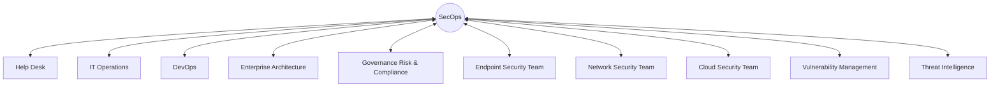
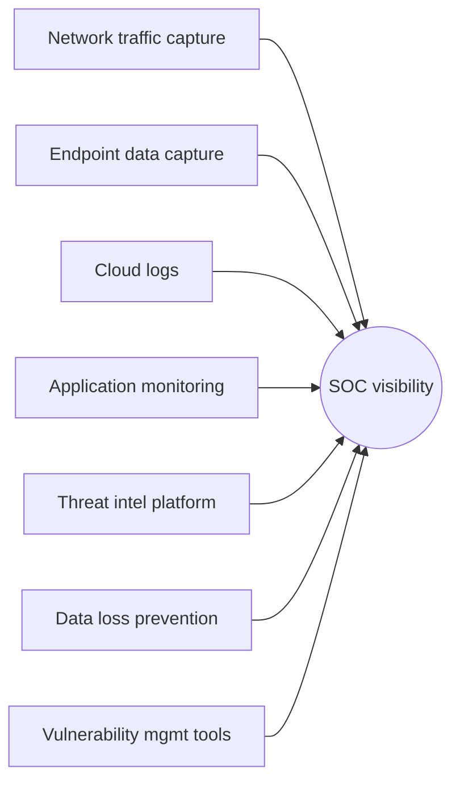
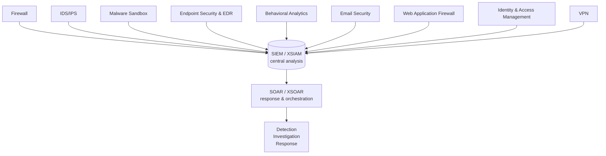

# Module 02 — SOC Elements: Interfaces, Visibility & Technology

**Source material:** Palo Alto Beacon — SOC Elements I & II
**Handwritten notes:** [`/notes/module-02-handwritten.pdf`](../notes/module-02-handwritten.pdf)
**Lab environment used throughout:** Ubuntu Server running Wazuh as SIEM, Windows + Ubuntu VMs as Wazuh agents, Kali Linux as the attacker machine

---

## Contents

1. [The Interfaces Pillar](#1-the-interfaces-pillar)
2. [The Visibility Pillar](#2-the-visibility-pillar)
3. [The Technology Pillar](#3-the-technology-pillar)
4. [Module Summary](#4-module-summary)
5. [References](#references)

---

## 1. The Interfaces Pillar

A SOC doesn't operate in isolation. It constantly has to work with other teams — IT operations, DevOps, legal, HR, cloud teams, third-party vendors — and every one of those interactions is called an **interface**. The Interfaces pillar exists to define what those interactions look like, who owns what, and where one team's responsibilities end and another's begin.

Without clearly defined interfaces, two bad things happen regularly. First, tasks fall through the gaps — nobody does them because both teams assumed the other one would. Second, teams step on each other — two groups acting on the same system in conflicting ways because nobody defined the boundary. Both create friction, both create risk.

### Why you need to understand other teams' goals

The most important thing to internalize about interfaces is that **different teams have genuinely different priorities**, and those priorities sometimes conflict with security. This isn't because those teams don't care about security — it's because their actual job is something else, and security is a constraint on that job, not the job itself.

| Team | Their actual goal | Where friction happens with SecOps |
|---|---|---|
| **Help Desk** | Close tickets as fast as possible | Security investigations slow down ticket resolution |
| **IT Operations** | Keep infrastructure available and performant | Security controls (patching, monitoring agents) can impact uptime |
| **DevOps** | Ship features fast, fix bugs quickly | Security review adds time to release cycles |
| **Operational Technology** | Keep industrial/physical systems running continuously | OT systems can't be patched or restarted the same way IT systems can |

Understanding these motivations isn't just useful for being diplomatic — it's essential for designing interfaces that actually work. If SecOps demands something that genuinely breaks another team's ability to do their job, that team will route around SecOps. The goal is to define interfaces that make security achievable without being unreasonable.

### The teams SecOps interfaces with

**Enterprise Architecture**

This team designs and maintains the physical and virtual network. Their job is to understand business requirements and translate them into network designs that meet those requirements. Critically, they're responsible for baking security into the design phase — not bolting it on afterward. This matters a lot to SecOps because a network designed with security in mind is dramatically easier to monitor and defend than one where security was retrofitted into an architecture that wasn't designed for it.

They produce and maintain architecture flowcharts and diagrams, which become reference material for SecOps investigations (understanding what should be talking to what makes anomalous traffic obvious).

**Governance, Risk, and Compliance (GRC)**

GRC creates the guidelines that define how risk is managed and how compliance requirements are met. Common compliance frameworks SecOps has to operate under include PCI-DSS (payment card data), HIPAA (healthcare data), and GDPR (personal data of EU citizens). Each of these frameworks specifies different requirements around what data has to be protected, how it's encrypted, where it can be stored, and how long it has to be retained.

SecOps needs a working relationship with GRC because detection and response activities generate evidence — log data, incident records, forensic artifacts — that may have to meet compliance standards to be usable or admissible. An investigation that destroys evidence through poor handling, or data that gets deleted before a required retention period ends, is a compliance failure as well as a security failure.

**Business Liaison**

The business liaison's job is to bridge security and the rest of the business — translating security findings into business impact terms that non-technical stakeholders can understand, and translating business requirements back into guidance for the security team. They also manage relationships with partners, vendors, and teams that have external-facing interfaces with SecOps.

**SecOps Engineering**

SecOps engineering implements and maintains the security team's own tools — the SIEM, analysis platforms, detection infrastructure. This is distinct from the analysts who use those tools; the engineering team builds and maintains the environment those analysts work in.

One of the most important things this team manages is **Service Level Agreements (SLAs)** — formal agreements that specify who is responsible for what, including licensing, maintenance, and updates for security tools. Without clear SLAs, questions like "who patches the SIEM?" or "who maintains the cloud connectors?" end up answered by nobody.

### Cybersecurity collaboration teams

**Endpoint Security Team**

Responsible for developing, implementing, and maintaining the endpoint security policy across the organization — covering what endpoint technologies are allowed, what operating systems are supported, and what endpoint protection platform (EPP) and endpoint detection and response (EDR) capabilities are deployed.

The interface between endpoint security and SecOps is becoming increasingly important because **EDR telemetry is one of the richest sources of investigation data available to an analyst**. When an alert fires, the endpoint agent's record of what processes ran, what files were created, and what network connections were made in the moments around the alert is often the difference between a quick, confident triage and a long, uncertain investigation.

**Network Security Team**

Manages the network security infrastructure — firewalls, IDS/IPS, proxies, network segmentation. Their work is the first line of detection for traffic-based attacks. SecOps needs a clearly defined interface with this team to understand what alerts will come from network security controls, what the response process is when those alerts fire, and who has the authority to block traffic or change firewall rules during an active incident.

**Cloud Security Team**

As workloads migrate to cloud, a growing portion of the attack surface lives in environments SecOps doesn't directly control in the same way as on-premises infrastructure. The cloud security team manages that environment. The interface with SecOps needs to define what cloud logs flow into the SIEM, what alerts are generated by cloud security controls, and how incident response plays out in a cloud context — including the shared responsibility model, where the cloud provider is responsible for some things and the organization is responsible for others.

### Threat Hunting and Content Engineering

**Threat Hunting** is proactive investigation — analysts going looking for evidence of compromise that hasn't triggered an automated alert. This is distinct from reactive investigation (responding to alerts that have already fired). Hunters use knowledge of attacker techniques, threat intelligence, and their understanding of the environment to form hypotheses and test them against available data.

**Content Engineering** is the work of building and maintaining the detection logic that makes automated alerting possible — writing SIEM rules, correlation rules, detection content. This is the team that defines what the SIEM looks for. They have a direct interface with both threat hunting (hunts often discover gaps that content engineering needs to close with new rules) and with SecOps (the alerts content engineering produces are what analysts respond to).

### Security Automation

The security automation team maintains the automated playbooks that let the SOC respond to common incident types without human intervention. They implement new automation in response to new workflows defined by the SecOps team, and they're responsible for vetting those automations before deployment.

Vetting matters here. Before investing in a new automation, three questions need to be answered honestly:

- How much analyst time does this actually save?
- Is the automation accurate enough that false positives don't create new work?
- What is the ongoing cost of maintaining this, and does it justify the savings?

Automation that's poorly designed or poorly maintained creates more work than it eliminates.

### Forensics vs Telemetry — an important distinction

These two terms are often used interchangeably in casual conversation, but they mean genuinely different things and are used for different purposes.

| | Forensics | Telemetry |
|---|---|---|
| **What it is** | Evidence prepared for legal proceedings by an expert — must be repeatable, defensible, and must not modify the original data | A continuous stream of real-time activity data from a given source |
| **Key characteristic** | Selective — specific evidence collected following defined legal standards | Inclusive — broadly records activity, rarely captures actual content |
| **How it's triggered** | Specific event, typically post-incident | Continuously, regardless of whether anything suspicious has happened |
| **Primary use** | Court proceedings, formal investigations | Alert triage, incident investigation, threat hunting |

The practical takeaway: **most day-to-day SOC work uses telemetry**, not forensics. Forensics in the true sense is reserved for situations where evidence may need to survive a legal challenge, and the collection process has to meet standards that would hold up under cross-examination.

### Vulnerability Management

The vulnerability management team tracks known vulnerabilities, prioritizes them based on risk to the organization, and coordinates the patching process. Their interface with SecOps runs in both directions:

- When a new critical vulnerability is announced, vulnerability management works with SecOps to implement compensating controls while the patch is prepared and tested — SecOps needs to know what those controls are so it can correctly triage any alerts that fire against them
- When SecOps encounters something in an investigation that looks like a new vulnerability or newly discovered malware, that finding gets shared back to vulnerability management

---

## 2. The Visibility Pillar

The Visibility pillar answers one core question: **what can we actually see?** Detection is only possible for things the SOC has visibility into. Every blind spot — traffic that isn't logged, a system that doesn't forward events to the SIEM, encrypted traffic that passes through uninspected — is a place an attacker can operate undetected.

### Network Traffic Capture

Network traffic capture is the interception and logging of traffic moving across the network. This can happen at firewalls, IDS/IPS systems, proxies, routers, switches, or dedicated capture appliances. The purpose is straightforward: if you have logs of what traffic moved across your network, you can go back and analyze specific traffic when an alert fires.

Analysts should have access to **raw traffic logs** when a specific piece of traffic is associated with an alert, or when an investigation requires it. "Access to logs in a dashboard" and "access to raw traffic data" are different things — an analyst investigating a sophisticated attack may need the raw packet-level data that a dashboard summary doesn't show.

### Endpoint Data Capture

Endpoints generate three types of data that matter to SecOps, and each has a different use:

| Type | How it's generated | Primary use |
|---|---|---|
| **Logs** | Generated when a specific, predefined event occurs | Alert correlation — logs tie specific events to alerts |
| **Telemetry** | Continuously recorded real-time activity | Alert triage, incident investigation, threat hunting |
| **Forensics** | Captured following defined legal standards | Detailed post-incident analysis, legal proceedings |

Endpoint data capture typically requires an agent running on the device — either a persistent background agent or a runtime agent that activates when needed. Endpoints in this context means devices running a common user-facing OS: Windows, macOS, ChromeOS. Notably, **mobile devices and IoT devices are usually handled differently**: mobile devices typically fall under endpoint security, while IoT devices typically fall under network security, because the same agent-based approach doesn't work for most IoT hardware.

### Cloud Computing Visibility

Cloud introduces visibility challenges that don't exist in on-premises environments, because the organization doesn't control the underlying infrastructure — only the workloads running on top of it.

**Policy enforcement** in a cloud context means applying enterprise security policies to cloud-based resources. This includes single sign-on (SSO), authentication and authorization controls, device profiling (ensuring only authorized devices can access cloud resources), and step-up authentication challenges when something unusual is detected.

**Log collection from cloud** provides both detailed forensic data and correlated event data to SecOps. The important distinction here is calibration — the SecOps team needs to define exactly what cloud logs they need for proper investigation, and at what level of access, rather than just ingesting everything available. Ingesting everything creates a noise problem; ingesting too little creates a visibility gap. Cloud security controls also generate their own alerts, which need to be worked into the incident response plan so analysts know how to handle them when they appear.

### Application Monitoring, SSL Decryption, and URL Filtering

**Application monitoring** gives SecOps visibility into what applications are actually being used on the network, as opposed to what's supposed to be used. Unauthorized or shadow IT applications are a significant risk because they introduce data flows the organization doesn't control and hasn't evaluated.

**SSL/TLS decryption** is one of the most operationally significant visibility decisions a SOC makes. The majority of web traffic is now encrypted — typically 70-80% or more. Without SSL inspection enabled, that traffic passes through the network completely opaque to monitoring tools. This was already mentioned as a configuration confidence failure in Module 1, and it's worth repeating here from the visibility angle: **if SSL decryption isn't enabled, the majority of traffic in most modern networks is invisible to the SOC.**

**URL filtering** controls which web destinations are reachable from the corporate network, and logs attempts to reach blocked destinations. From a SecOps perspective, URL filter logs are valuable investigation data — a machine trying to reach a known-malicious domain is a strong indicator of compromise even before a full investigation is complete.

### Asset Management, Knowledge Management, and Case Management

These three elements work together to make the SOC operationally functional rather than just technically capable.

**Asset management** is the maintained inventory of every device, system, application, and data store the organization owns or is responsible for. Its importance to SecOps is fundamental: you can't protect what you don't know exists. An alert about activity on an unknown asset is harder to triage because there's no baseline for what normal looks like on that system. Asset management provides the baseline context that makes triage faster and more accurate.

**Knowledge management** is the organizational memory of the SOC — documented investigation procedures, known-good/known-bad patterns, institutional knowledge about the environment. A well-maintained knowledge base means that when the same type of incident recurs, the analyst handling it doesn't have to rediscover the investigation process from scratch.

**Case management** is the system used to track open investigations — what happened, what analysis was done, what actions were taken, and what the outcome was. Beyond the organizational value, case management creates an auditable record: if an incident later becomes a legal matter, or if a compliance audit requires evidence of how incidents are handled, the case management system is the primary source.

### Data Loss Prevention (DLP)

DLP is a control designed to detect and prevent the accidental or malicious release of sensitive or proprietary data — what's called data exfiltration. DLP systems sit at key data egress points (email, web uploads, USB, cloud storage) and generate alerts when content that looks like sensitive data is about to leave the organization.

Those alerts come to SecOps, which then investigates whether the transmission represents a genuine incident (a malicious insider or an attacker who already has access) or an accidental policy violation (an employee who didn't realize the data was sensitive). DLP is also useful for detecting the presence of an advanced persistent threat (APT) — an attacker who's been inside the network for a long time and is beginning to exfiltrate data is exactly the kind of activity DLP is designed to catch.

### Lab notes

In my Wazuh setup, visibility is the constraint I feel most concretely. The agents on the Windows and Ubuntu VMs give me reasonable endpoint visibility on those machines. What I don't have yet is network-level visibility — raw traffic capture that would let me see what connections are actually happening between systems. That's the next gap to close.

📸 *[Add: screenshot showing Wazuh log sources — what's currently feeding in and what isn't yet]*

---

## 3. The Technology Pillar

The Technology pillar is the actual tooling — the software and hardware that makes detection, prevention, and response possible. It's the most visible part of a SOC and the easiest to point to, which is probably why it gets overemphasized relative to the other pillars. Technology without the right people, processes, and visibility feeding it is expensive infrastructure that doesn't produce good outcomes.

### Firewall, IDS/IPS, and Malware Sandbox

**Firewalls** control what traffic is allowed to enter and leave the network based on defined rules. They are the network boundary enforcement point. From a SecOps perspective, firewall logs are a primary source of visibility into what's trying to reach the network and what the network is trying to reach externally.

**Intrusion Prevention and Detection Systems (IPS/IDS):**
- An IDS (Intrusion Detection System) monitors traffic and generates alerts when it sees patterns matching known attacks — but it doesn't block anything on its own
- An IPS (Intrusion Prevention System) does the same detection but also has the ability to block the detected traffic automatically

Both generate alerts that flow into the SIEM. The difference is in what happens after detection: IDS requires a human to act on the alert, IPS can act immediately without waiting for human decision. The tradeoff is that IPS false positives block legitimate traffic — so tuning IPS rules correctly matters more than tuning IDS rules.

**Malware sandboxes** allow suspicious files to be executed in an isolated, controlled environment to observe their behavior without risk to real systems. A file that looks clean to static analysis (no known malware signatures) can be placed in the sandbox and run to see what it actually does — whether it makes network connections, modifies system files, establishes persistence, or exhibits other malicious behavior. This is the standard approach for analyzing suspicious email attachments or files found during an investigation.

### Endpoint Security and Behavioral Analytics

**Endpoint security** includes antivirus, EDR (Endpoint Detection and Response), device control, and analytics capabilities running on individual machines. SecOps needs to define what endpoint data gets forwarded to the SIEM — not everything the endpoint agent captures necessarily needs to go into central logging, and sending everything creates noise. An interface agreement should define how mitigation actions get executed (for example, isolating an endpoint during an active incident), how to request changes to endpoint configuration, and how those changes get validated.

**Behavioral analytics** approaches detection differently from signature-based tools. Instead of looking for patterns that match known attacks, it establishes a baseline of what "normal" looks like for a given user, device, or system, and then alerts when current behavior deviates significantly from that baseline.

The process works in three stages:
1. Inspect endpoint, network, or user data to automatically classify user and device types
2. Develop a behavioral baseline — what does normal activity look like for this entity
3. Continuously compare current behavior to the baseline and to peer behavior (what are similar users/devices doing), flagging significant deviations

Machine learning improves this over time by tailoring detection thresholds to the specific organization's environment, reducing false positives as the model learns what's normal for that particular context.

Behavioral analytics is particularly effective at detecting: malware that doesn't match known signatures, ransomware in early stages before encryption begins, lateral movement (an attacker moving between systems inside the network), data exfiltration, insider threats, and anomalous user behavior that might indicate a compromised account.

### Email Security and Web Application Firewall (WAF)

**Email security** is arguably the most important preventive control for most organizations, because phishing and email-delivered malware remain the most common initial access vector. Email security covers:

- Scanning attachments for malware
- Analyzing links for phishing indicators
- Authenticating senders to prevent spoofing (DMARC — Domain Message Authentication Reporting and Conformance — is the current standard for this)
- Providing confidentiality and integrity controls via encryption and digital signatures

SecOps needs email security data because credential compromise often starts with a phishing email. When an analyst is investigating a compromised account, one of the first questions is whether a phishing email is in the user's inbox — email security telemetry provides that data.

**Web Application Firewall (WAF)** protects HTTP-based applications from well-known web exploits — SQL injection, cross-site scripting, directory traversal, and similar attacks. Where a regular network firewall controls access at the IP/port level, a WAF operates at the application layer, understanding HTTP requests well enough to distinguish legitimate requests from malicious ones targeting application vulnerabilities.

### VPN, Mobile Device Management, NAC, and IAM

**Virtual Private Networks (VPNs)** allow remote users to connect to the corporate network over encrypted tunnels from external locations. The security implication: once a user's VPN session is established, their traffic is treated as if it's on the internal trusted network — meaning it may bypass firewall and IDS/IPS controls that external traffic would face. SecOps needs visibility into VPN traffic specifically to monitor for anomalous remote user behavior.

**Mobile Device Management (MDM)** manages and secures mobile devices (phones, tablets) that access corporate resources — enforcing encryption, requiring passcodes, enabling remote wipe if a device is lost, and controlling what apps can be installed. MDM events (device enrollment, compliance failures, remote wipes) are relevant to SecOps investigations.

**Network Access Control (NAC)** controls which devices are allowed to connect to the network, based on their compliance with security policies. A device that hasn't been patched recently, doesn't have an endpoint agent running, or isn't recognized as a corporate asset can be quarantined or denied access entirely. This reduces the risk from unmanaged or compromised devices connecting to the corporate network.

**Identity and Access Management (IAM)** manages who has access to what, and provides the authentication and authorization infrastructure. IAM logs — successful and failed logins, privilege escalations, account creation and deletion, access requests — are among the most valuable data sources SecOps has. Anomalous access patterns (logins at unusual hours, from unusual locations, followed by privilege escalation) are some of the clearest indicators of a compromised account.

### SIEM and XSIAM

A SIEM (Security Information and Event Management) is the central repository where logs and events from across the organization are collected, processed, and analyzed. It ingests audit trails, activity logs, security alarms, telemetry, metadata, and observational data from a wide variety of sources, correlates those inputs, and generates alerts when correlated patterns match detection rules.

Before a SIEM works properly, connectors and interfaces need to be configured to translate data from each source system into a format the SIEM can ingest. This is non-trivial work — each data source speaks its own log format, and the SIEM needs to parse all of them consistently.

**XSIAM (Extended Security Intelligence and Automation Management)** is the modern evolution of the traditional SIEM concept. Where a SIEM focuses on collecting, analyzing, and correlating security data, XSIAM extends this by incorporating automation, threat intelligence integration, and advanced AI-driven features to improve detection accuracy, investigation speed, and response capabilities. Palo Alto Networks' Cortex XSIAM is the specific product in this course's context; it's covered in depth in a later module.

The SIEM governance considerations that matter for SOC design:
- **Separation of data** — some data types may need to be stored separately for compliance reasons
- **Data retention** — compliance frameworks often mandate minimum retention periods for log data; the SIEM configuration needs to reflect that
- **Cost control** — ingesting everything into a SIEM can become very expensive; defining what actually needs to be in the SIEM (vs archived elsewhere) is a real operational decision

### SOAR and XSOAR

**SOAR (Security Orchestration, Automation, and Response)** as defined by Gartner: technology that enables organizations to collect inputs from security tools, perform incident analysis and triage using a combination of human and automated decision-making, and execute standardized incident response activities through automated playbooks.

The key capability SOAR adds on top of a SIEM: **automated response execution**. A SIEM detects and alerts; a SOAR can detect, alert, and also automatically execute the first several steps of the response — gathering additional context, enriching the alert with threat intelligence, notifying the right analyst, and in some cases taking containment actions without waiting for a human.

**XSOAR (Extended SOAR)** goes further by incorporating case management into the same platform, enabling deeper automation, and providing a more unified view of security data across tools. Where traditional SOAR focused primarily on orchestrating response workflows, XSOAR brings case management (tracking the full investigation lifecycle) into the same environment.

### Lab notes

My Wazuh setup covers the SIEM layer — centralized log collection from Windows and Ubuntu agents, correlation rules, and alert generation. What it doesn't yet cover is the SOAR layer — automated response execution when an alert fires. That's the next meaningful gap to address: currently every Wazuh alert requires manual follow-up, and a real SOC environment would have at least some of those automated.

📸 *[Add: screenshot of SIEM alert pipeline — showing a log arriving, being processed, and generating an alert]*
📸 *[Add: screenshot of the Wazuh rules/correlation view]*

---

## 4. Module Summary

Modules 1 and 2 together cover the full Six Pillars model. Module 1 established the Business pillar in depth. This module covers the remaining three: Interfaces, Visibility, and Technology.

The key threads that run through all three:

**Interfaces:** A SOC that doesn't clearly define its relationships with other teams will constantly fight about ownership, drop things in the gaps, and create friction that erodes the effectiveness of everyone involved. Defining interfaces isn't bureaucracy for its own sake — it's the organizational infrastructure that makes coordinated defense possible.

**Visibility:** Detection is bounded by what you can see. Every tool in the Technology pillar is only as useful as the data feeding it, and the Visibility pillar defines what data is actually available. SSL decryption, endpoint agents, cloud log collection — these aren't optional nice-to-haves, they're the difference between a SOC that can see what's happening and one that's operating partially blind.

**Technology:** The technology stack supports detection, prevention, and response — but it's downstream of everything else. The right tools poorly configured, with poor visibility feeding them, operated by people with unclear interfaces and responsibilities, produce poor outcomes regardless of how much was spent on them.

---

## References

1. **Personal handwritten notes** — Module 2, written while studying Palo Alto Beacon SOC Elements content
2. **Palo Alto Beacon** — primary course this module is based on (SOC Elements I: Business, People & Processes; SOC Elements II: Interfaces, Visibility & Technology)
3. Palo Alto Networks, *"The Six Pillars of Effective Security Operations"* — paloaltonetworks.com/blog/2020/01/cortex-security-operations
4. Gartner definition of SOAR — gartner.com/en/information-technology/glossary/security-orchestration-automation-response-soar
5. MITRE ATT&CK® — attack.mitre.org — for attacker technique references (lateral movement, exfiltration, persistence)
6. Wazuh official documentation — documentation.wazuh.com

---

## Lab Evidence Checklist

- [ ] Screenshot of current Wazuh log sources — what's feeding in and what gap still exists (Section 2)
- [ ] Screenshot of SIEM alert pipeline — log arrival → processing → alert (Section 3)
- [ ] Screenshot of Wazuh rules/correlation view (Section 3)
